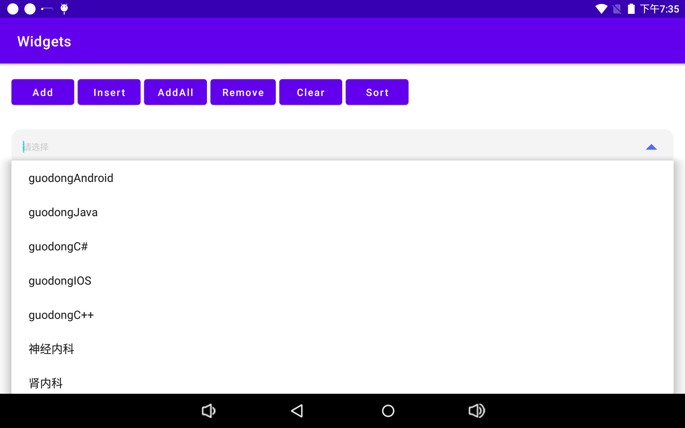
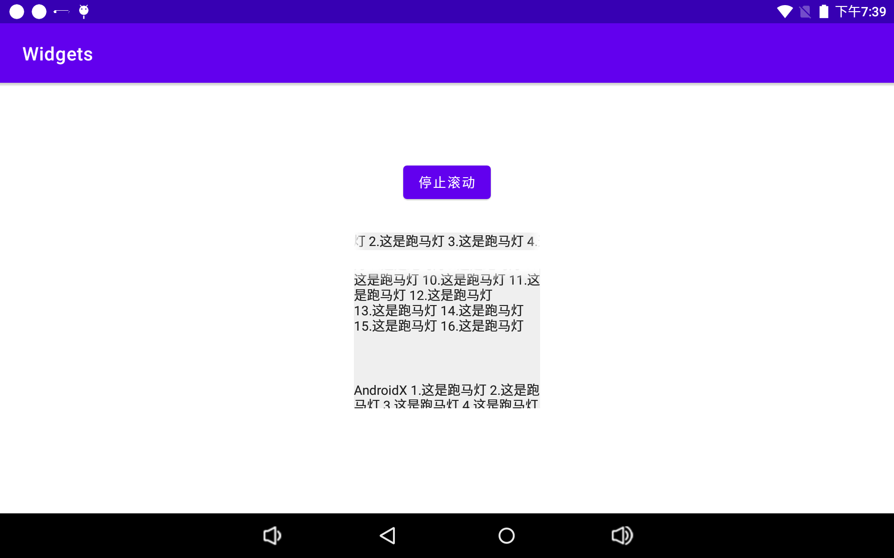

# Widgets

## 1.集成

### 0.Version

`def version = 1.0-alpha04`

### 1.Project level build.gradle

```
maven {
	url "https://raw.githubusercontent.com/guodongAndroid/maven/main/repository/"
}

or

maven {
	url "https://gitee.com/guodongAndroid/maven/raw/main/repository/"
}
```

### 2.App level build.gradle

```
implementation "com.guodong.android:widgets:$version"
```

## 2.Widgets

### 1.DropSearchEditText

> 下拉搜索输入框

1. 支持下拉箭头自定义
2. 支持输入框过滤
3. 支持下拉箭头可点击



### 2.MarqueeTextView

> 横/纵向跑马灯

1. 支持横向/纵向跑马灯



